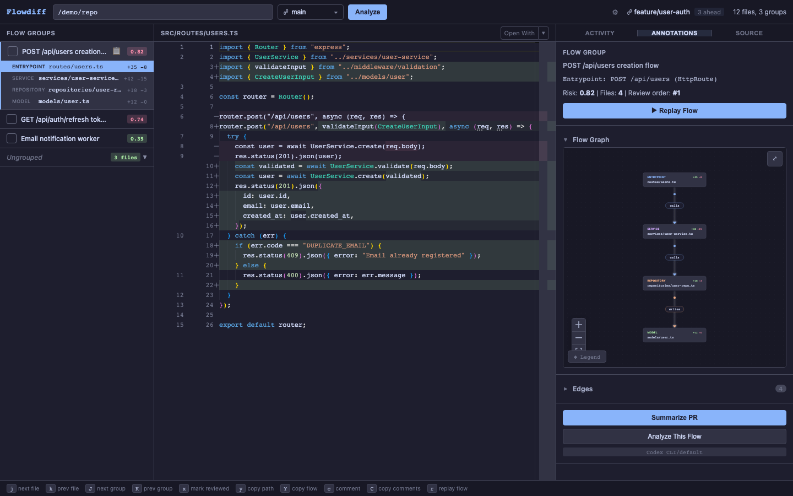
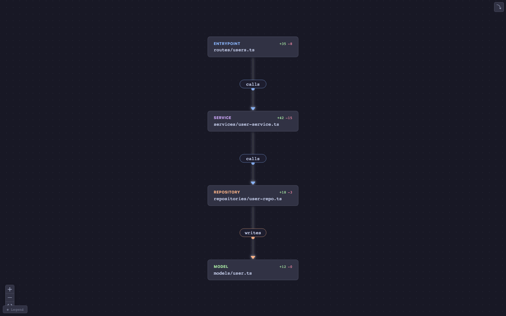
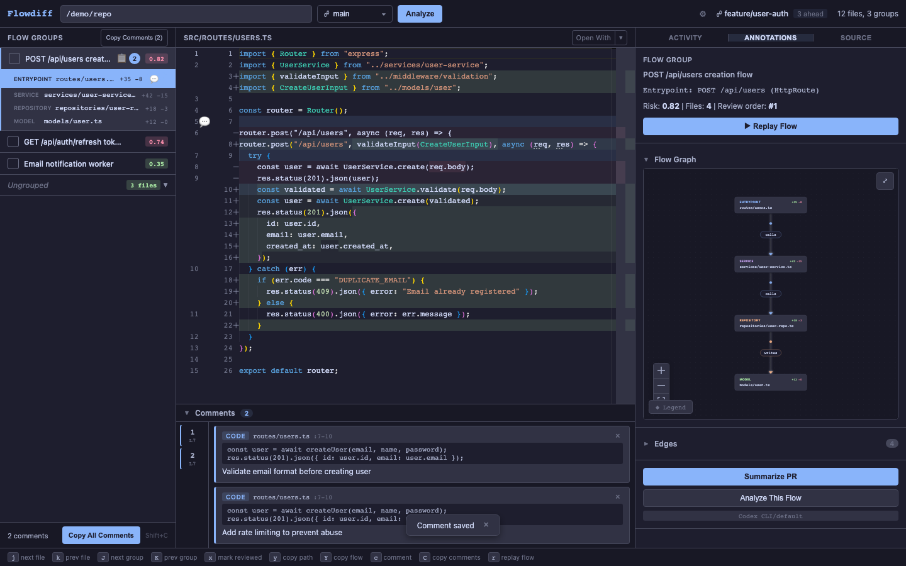
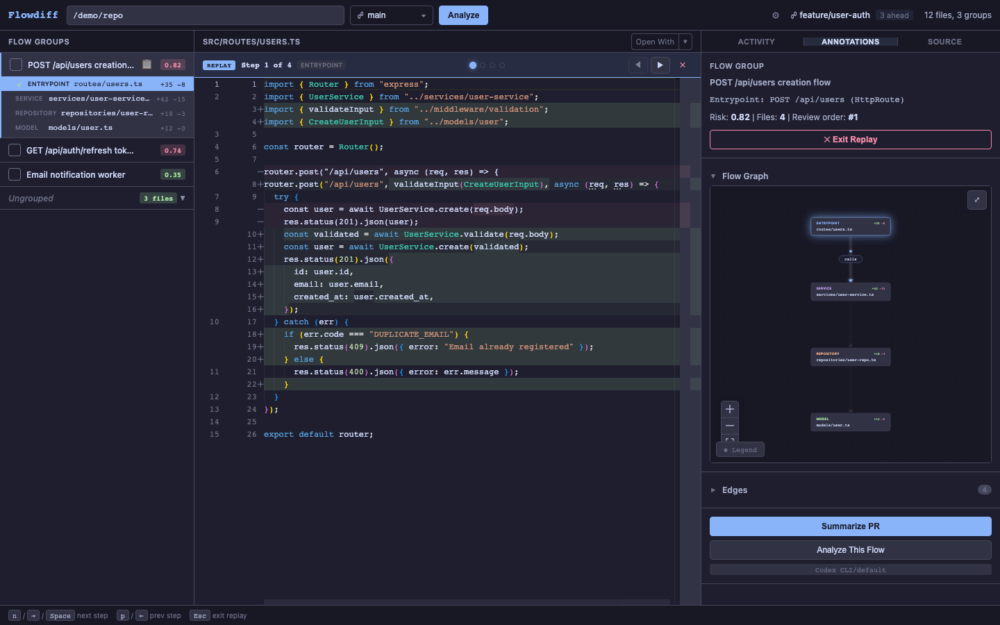

# Diffcore

**Semantic diff layer for code review.** Git gives you syntactic diffs. Diffcore adds meaning: what those changes *mean*, how they relate, and what order a human should read them in.

Built for the era of AI agents producing 50+ file PRs.



## How it Works

Diffcore transforms flat file diffs into ranked, semantically grouped review flows through three layers:

**Structural analysis** (free, deterministic) builds a symbol graph from tree-sitter ASTs, detects entrypoints (HTTP routes, CLI commands, queue consumers, Effect.ts services), clusters changed files into flow groups via forward reachability, and traces data flow across call chains.

**Heuristic scoring** (free, deterministic) provides framework detection (Express, Next.js, FastAPI, Effect.ts, 30+ frameworks), risk scoring, and review ordering by composite score combining risk, centrality, surface area, and uncertainty.

**LLM refinement** (paid, optional) uses Anthropic, OpenAI, or Gemini to read the actual diff and refine groupings: split coincidental coupling, merge scattered refactors, and re-rank by semantic review order. An evaluator-optimizer loop keeps whichever version scores better.

## Features

**Flow Groups** cluster related file changes into logical review units ordered by data flow, so you read code in the order it executes.

**Flow Graph** visualizes the call graph between changed files with animated edges showing data direction. Click any node to navigate to that file.



**Review Comments** let you annotate code with comments scoped to lines, files, or groups. Comments show as gutter icons in the editor, with a comment strip below the diff for quick navigation.



**Replay Mode** walks you through each file in a flow group step by step, following the data flow path from entrypoint to leaf.



**Keyboard Driven** navigation: `j`/`k` for files, `J`/`K` for groups, `r` for replay, `c` for comments, `x` to mark reviewed.


**Open With** lets you jump to any file in VS Code, Cursor, Zed, Vim, or Terminal directly from the diff viewer.

## Installation

### CLI

```bash
cargo install --path crates/diffcore-cli
```

Or build a release binary and symlink it:

```bash
cargo build --release -p diffcore-cli
ln -sf "$(pwd)/target/release/diffcore" /usr/local/bin/diffcore
```

### Tauri Desktop App

```bash
cd crates/diffcore-tauri/ui && npm install
cargo tauri build
```

The built app is in `target/release/bundle/`.

For development:

```bash
cargo tauri dev
```

### VS Code Extension

```bash
cd extensions/vscode
npm install && npm run compile
```

Then install the `.vsix` via "Extensions: Install from VSIX" in VS Code.

## Usage

### CLI

```bash
# PR preview (default): merge-base diff main...HEAD
diffcore analyze

# Branch comparison
diffcore analyze --base main --head feature-branch

# Commit range
diffcore analyze --range HEAD~5..HEAD

# Staged or unstaged changes
diffcore analyze --staged
diffcore analyze --unstaged

# Save to file
diffcore analyze --base main -o review.json

# With LLM annotations (overview summary)
diffcore analyze --base main --annotate

# With LLM refinement of groupings
diffcore analyze --base main --refine
diffcore analyze --base main --refine --refine-model gpt-4o

# Analyze a different repo
diffcore analyze --base main --repo /path/to/repo

# Open a flow group in an external diff tool
diffcore launch --tool bcompare --group group_1 --input review.json
```

Supported external diff tools: Beyond Compare (`bcompare`), Meld (`meld`), KDiff3 (`kdiff3`), VS Code (`code`), macOS FileMerge (`opendiff`).

### Tauri Desktop App

Three panel layout:

| Panel | Contents |
|-------|----------|
| Left | Flow groups ranked by review score with expandable file trees |
| Center | Monaco diff viewer with syntax highlighting and comment gutter icons |
| Right | Annotations, flow graph, and LLM analysis |

The app auto-discovers git branches, worktrees, and push status on launch. Enter a repository path and press Enter to analyze.

### VS Code Extension

| Command | Key | Description |
|---------|-----|-------------|
| `diffcore.analyze` | | Analyze current branch |
| `diffcore.analyzeRange` | | Analyze a commit range |
| `diffcore.annotate` | | Annotate with LLM |
| `diffcore.nextFile` | `j` | Next file in flow |
| `diffcore.prevFile` | `k` | Previous file in flow |
| `diffcore.nextGroup` | `Shift+J` | Next flow group |
| `diffcore.prevGroup` | `Shift+K` | Previous flow group |

## Configuration

Diffcore now splits configuration into:

- `~/.diffcore/config.toml` for shared LLM/onboarding settings across all repos
- `.diffcore.toml` in the repo root for project-specific analysis settings

New users can usually skip API keys entirely: the desktop app auto-detects `codex` and `claude`, and will use those subscriptions when available.

Example global config:

```toml
[llm]
provider = "codex"   # "codex", "claude", "anthropic", "openai", or "gemini"
model = "default"

[llm.refinement]
enabled = true
provider = "claude"
model = "default"
max_iterations = 1
```

Example repo-local config:

```toml
[project]
name = "my-app"

[entrypoints]
http = ["src/routes/**/*.ts"]
workers = ["src/jobs/**/*.ts"]
cli = ["src/cli/main.rs"]

[layers]
api = "src/handlers/**"
domain = "src/services/**"
persistence = "src/repositories/**"
ui = "src/components/**"

[ignore]
paths = ["**/*.test.ts", "**/*.spec.ts", "migrations/**"]

[ranking]
risk = 0.35
centrality = 0.25
surface_area = 0.20
uncertainty = 0.20
```

### API Key Resolution

When using direct API providers (`anthropic`, `openai`, `gemini`), Diffcore checks for API keys in this order:

1. `key_cmd` in `~/.diffcore/config.toml` or `.diffcore.toml`
2. `key` in `~/.diffcore/config.toml` or `.diffcore.toml`
3. `DIFFCORE_API_KEY`
4. Provider specific env var: `ANTHROPIC_API_KEY`, `OPENAI_API_KEY`, or `GEMINI_API_KEY`

When using `codex` or `claude`, Diffcore uses the local CLI login instead of an API key and lets that agent inspect the repository with structured output constraints.

## Architecture

```
diffcore/
├── crates/
│   ├── diffcore-core/          # Library: all analysis logic
│   │   ├── src/
│   │   │   ├── git.rs          # Git diff extraction (git2)
│   │   │   ├── ast.rs          # Tree-sitter parsing
│   │   │   ├── ir.rs           # Language-agnostic IR
│   │   │   ├── query_engine.rs # Declarative .scm query engine
│   │   │   ├── graph.rs        # Symbol graph (petgraph)
│   │   │   ├── flow.rs         # Data flow tracing
│   │   │   ├── cluster.rs      # Semantic grouping
│   │   │   ├── rank.rs         # Review ordering
│   │   │   ├── entrypoint.rs   # Entrypoint detection
│   │   │   ├── cache.rs        # SHA-256 analysis caching
│   │   │   ├── config.rs       # .diffcore.toml parsing
│   │   │   └── llm/            # LLM providers, VCR caching, judge
│   │   └── queries/            # Declarative .scm tree-sitter queries
│   │       ├── typescript/
│   │       └── python/
│   ├── diffcore-cli/           # CLI interface
│   └── diffcore-tauri/         # Tauri desktop app
│       ├── src/                # Rust backend (IPC commands)
│       └── ui/                 # React + Vite frontend
├── extensions/
│   └── vscode/                 # VS Code extension
└── specs/                      # Design specifications
```

### Adding a New Language

Diffcore uses declarative tree-sitter query files. To add a new language:

1. Add `.scm` query files in `crates/diffcore-core/queries/<language>/`
2. Add the tree-sitter grammar crate to `Cargo.toml`
3. Register the language in the query engine

Zero Rust analysis code needed. The query engine maps `@capture` names to the shared IR types.

## Development

### Prerequisites

| Requirement | Version |
|-------------|---------|
| Rust | 1.75+ |
| Node.js | 18+ (for Tauri UI and VS Code extension) |
| libgit2 | System dependency for git2 |

### Building

```bash
# Build all crates
cargo build

# Build CLI only
cargo build -p diffcore-cli

# Build and run Tauri app in dev mode
cd crates/diffcore-tauri/ui && npm install
cargo tauri dev
```

### Testing

```bash
# Run all tests (1600+)
cargo test

# Specific crate
cargo test -p diffcore-core
cargo test -p diffcore-cli
cargo test -p diffcore-tauri

# Playwright E2E tests for the Tauri UI
cd crates/diffcore-tauri/ui && npx playwright test

# Focused browser E2E for the new AI activity transcript
cd crates/diffcore-tauri/ui && npx playwright test tests/e2e/activity-stream.spec.ts

# SSE transport integration for live activity streaming
cargo test -p diffcore-tauri --test activity_stream_integration -- --nocapture

# Smoke test the built macOS bundle stays alive during startup
DIFFCORE_RUN_APP_LAUNCH_TESTS=1 cargo test -p diffcore-tauri --test app_launch_smoke -- --nocapture

# Live LLM integration tests (API keys and/or authenticated CLIs)
DIFFCORE_RUN_LIVE_LLM_TESTS=1 cargo test -p diffcore-core -- --ignored

# Live Codex CLI / Claude Code activity tests
DIFFCORE_RUN_LIVE_LLM_TESTS=1 cargo test -p diffcore-core --test cli_activity_live -- --nocapture
```

## Contributing

1. Fork the repository
2. Create a feature branch
3. Make your changes with tests
4. Run `cargo test` and `npx playwright test`
5. Open a pull request

## License

MIT
